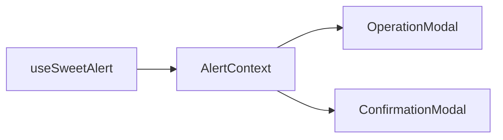
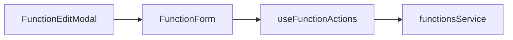

# Arquitectura del Proyecto - Sofia Chat Frontend V2

## Estructura General

### Directorios Principales

#### `/src/components`
- **Responsabilidad**: Componentes reutilizables de UI
- **Subcarpetas**:
  - `common/`: Componentes básicos (Button, Input, Modal)
  - `forms/`: Componentes específicos de formularios
  - `Diagrams/`: Sistema de diagramas y nodos (workflow visual)
  - `ChatWindow/`: Componentes del chat principal

#### `/src/pages`
- **Responsabilidad**: Páginas principales de la aplicación
- **Componentes**: Dashboard, Conversations, LogIn, SignUp, Organizations

#### `/src/hooks`
- **Responsabilidad**: Lógica reutilizable y estado compartido
- **Patrones**: Custom hooks para casos de uso específicos

#### `/src/services`
- **Responsabilidad**: Comunicación con APIs externas
- **Patrón**: Un servicio por entidad de negocio

#### `/src/interfaces`
- **Responsabilidad**: Definiciones de tipos TypeScript
- **Organización**: Por funcionalidad o entidad

#### `/src/store`
- **Responsabilidad**: Estado global de la aplicación
- **Tecnología**: Redux Toolkit

#### `/src/utils`
- **Responsabilidad**: Funciones utilitarias puras

## Patrones de Arquitectura

### 1. Composición de Componentes
- Componentes pequeños (< 500 líneas)
- Un componente por responsabilidad
- Programación funcional prioritaria

### 2. Inyección de Dependencias
- Props para comunicación entre componentes
- Hooks personalizados para lógica compartida
- Context API para estado global específico

### 3. Casos de Uso
- Un hook por caso de uso
- Separación clara entre lógica de negocio y UI
- No anidar casos de uso entre sí

### 4. Gestión de Estado
- **Local**: useState, useReducer
- **Compartido**: Context API (ej: AlertContext)
- **Global**: Redux Store
- **Servidor**: React Query patterns

## Flujos Principales

### Sistema de Modales

### Gestión de Funciones

### Autenticación

## Convenciones de Código

### Naming
- **Enums**: En lugar de union types de strings
- **Interfaces**: Reflejan estructura de APIs
- **Hooks**: Prefijo `use` + descripción del caso de uso

### Tipado
- **Estricto**: Evitar `any` a toda costa
- **Interfaces**: Para estructuras de datos
- **Types**: Para unions y utilitarios

### Estructura de Archivos
- **Exportaciones**: Solo lo necesario
- **Importaciones**: Específicas, no globales
- **Organización**: Un archivo por responsabilidad

## Reglas de Desarrollo

### Flujo Lineal
- Un flujo principal por funcionalidad
- Casos secundarios se inyectan como props
- Evitar anidación profunda de lógica

### Manejo de Errores
- Formateo centralizado en `useSweetAlert`
- Tipos específicos para errores de API
- Feedback visual consistente

### Performance
- Lazy loading para componentes grandes
- Memoization cuando sea necesario
- Evitar queries anidadas en ciclos

## Dependencias Clave

### UI Framework
- **React 18**: Hooks, Concurrent Features
- **TypeScript**: Tipado estricto
- **Tailwind CSS**: Utility-first styling

### Estado y Datos
- **Redux Toolkit**: Estado global
- **React Hook Form**: Formularios
- **Axios**: HTTP client

### Utilidades
- **Lottie**: Animaciones
- **React Router**: Navegación
- **Socket.io**: WebSocket connections

## Consideraciones de Arquitectura

### Escalabilidad
- Estructura modular permite crecimiento
- Separación clara de responsabilidades
- Patrones consistentes en todo el proyecto

### Mantenibilidad
- Documentación como reflejo del código
- Tests unitarios para casos de uso críticos
- Code review para mantener estándares

### Performance
- Bundle splitting por rutas
- Optimización de re-renders
- Caching inteligente de datos