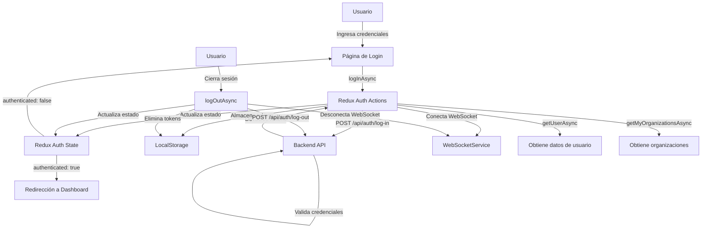
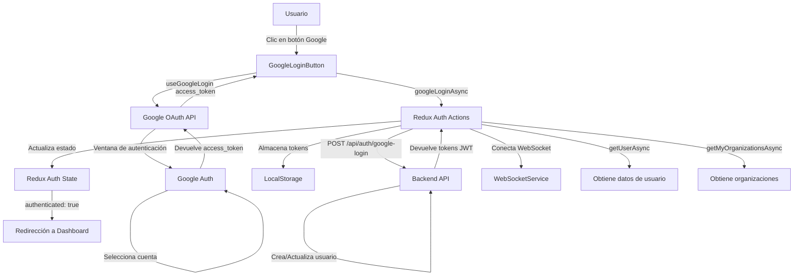
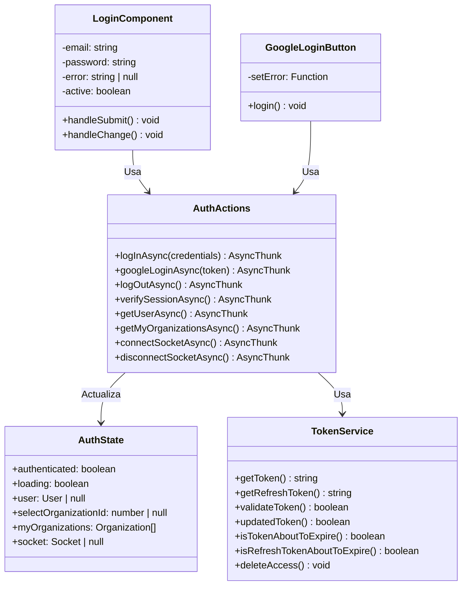
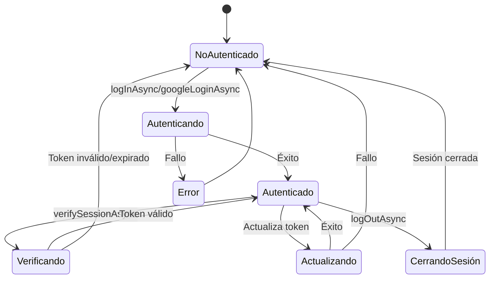

# Diagramas de Autenticación

Este documento contiene los diagramas que describen los flujos de autenticación en Sofia Chat Frontend.

## Flujo de Autenticación General

## Flujo de Autenticación con Google

## Estructura de Autenticación

## Ciclo de Vida de la Sesión

