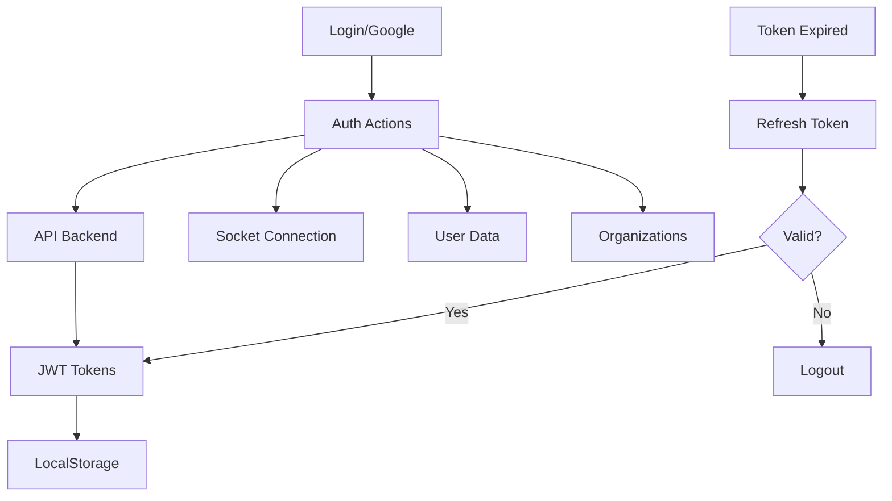
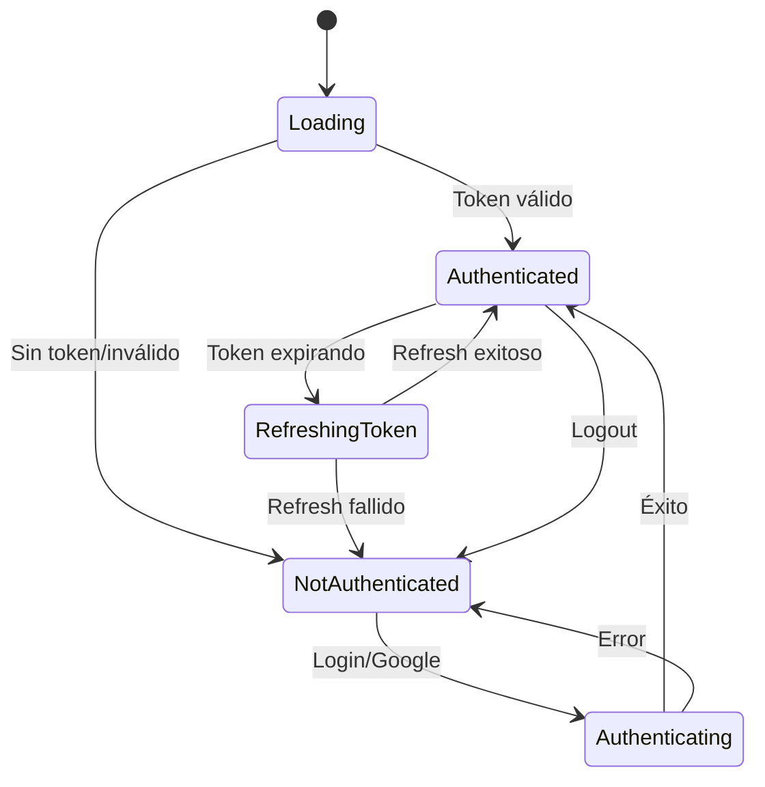
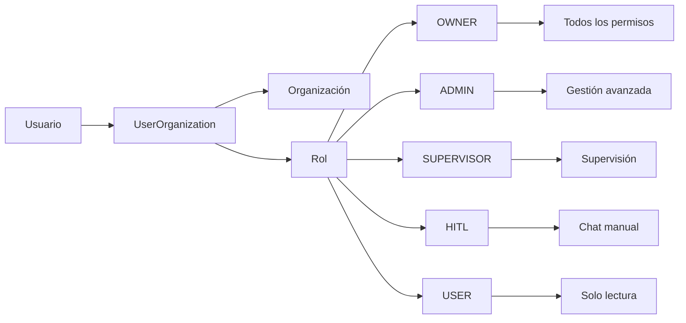
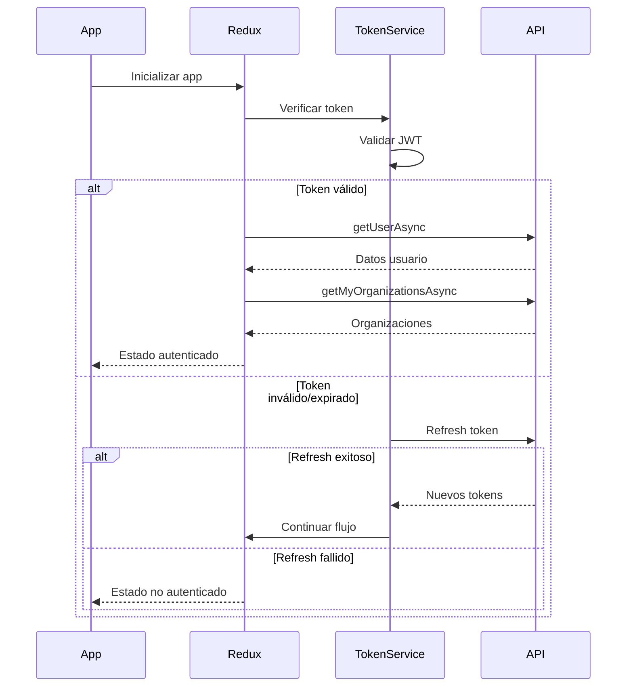

# Flujos de Autenticación

## Visión General

Sistema de autenticación JWT con refresh tokens, integración OAuth de Google y gestión de organizaciones multi-tenant.

## Flujo Principal de Autenticación

## Estados de Autenticación

## Componentes y Responsabilidades

### Auth State (Redux)
- **authenticated**: Estado de autenticación
- **user**: Datos del usuario actual
- **myOrganizations**: Organizaciones con roles
- **selectOrganizationId**: Organización activa
- **socket**: Conexión WebSocket

### Auth Actions
- **logInAsync**: Login con email/password
- **googleLoginAsync**: Login con Google OAuth
- **verifySessionAsync**: Validar sesión actual
- **getUserAsync**: Obtener datos de usuario
- **getMyOrganizationsAsync**: Cargar organizaciones
- **logOutAsync**: Cerrar sesión

### Token Management
- **Almacenamiento**: LocalStorage para tokens
- **Refresh automático**: Antes de expiración
- **Interceptores**: Axios para manejo automático
- **Validación**: JWT decode para verificar estado

## Roles y Permisos por Organización

## Estructura de Datos

### User
- `id`, `email`, `first_name`, `last_name`
- `email_verified`, `is_super_admin`
- `last_login`, `created_at`, `updated_at`

### Organization Relationship
- `id` (UserOrganization ID)
- `role` (OrganizationRoleType)
- `organization` (datos de organización)

## Flujo de Verificación de Sesión

## Configuración de Rutas Protegidas

### ProtectedAuth
- Verifica estado de autenticación
- Redirecciona a login si no autenticado
- Permite acceso a rutas principales

### ProtectedSuperAdmin
- Verifica rol de super administrador
- Restringe acceso a funciones globales
- Manejo de usuarios y organizaciones globales

## Socket Connection

- **Conexión automática**: Al autenticarse
- **Desconexión**: Al cerrar sesión
- **Reconexión**: Al cambiar de organización
- **Eventos**: Mensajes en tiempo real por organización