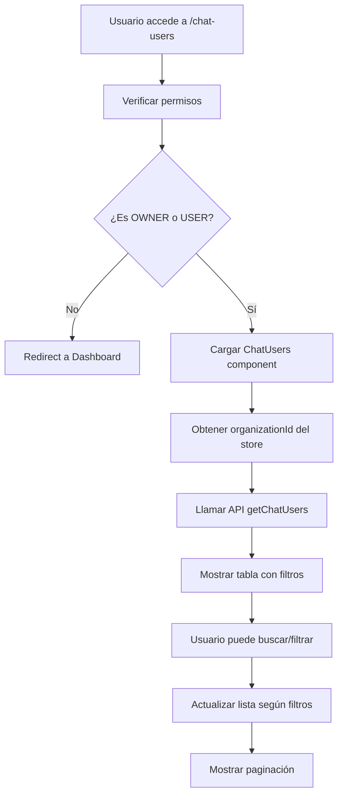

# Chat Users Use Case

Listado de clientes de la organización que han interactuado a través del chatbot.

## Errores Corregidos

### Error de DOM Nesting
- **Problema**: `<p>` anidados en ConversationCard (MessagePreview dentro de `<p>`)
- **Solución**: Cambié MessagePreview de `<p>` a `<span>`

### Error de Campos Nulos
- **Problema**: `Cannot read properties of null (reading 'charAt')`
- **Solución**: 
  - Validación de campos opcionales en ChatUserCard
  - Valores por defecto para campos undefined/null
  - Verificación de `standardInfo` antes de renderizar

### Manejo de Respuestas API Inconsistentes
- **Problema**: API puede retornar campos opcionales o estructura diferente
- **Solución**:
  - Validación de estructura de respuesta en el servicio
  - Filtrado de usuarios inválidos
  - Fallbacks seguros en lugar de errores

## Flujo Principal



## Componentes y Responsabilidades

### ChatUsers (index.tsx)
- **Ubicación**: `src/pages/ChatUsers/index.tsx`
- **Responsabilidad**: Página principal, manejo de estado y filtros
- **Estado gestionado**:
  - Lista de chat users
  - Paginación (página actual, total páginas)
  - Filtros (búsqueda, tipo)
  - Loading state

### ChatUserCard
- **Ubicación**: `src/pages/ChatUsers/ChatUserCard.tsx`
- **Responsabilidad**: Renderizar cada fila de la tabla
- **Información mostrada**:
  - Avatar con inicial del nombre
  - Datos básicos (nombre, email, teléfono)
  - Tipo de chat con color distintivo
  - Fechas formateadas

### getChatUsers Service
- **Ubicación**: `src/services/chatUsers.ts`
- **Responsabilidad**: Comunicación con API
- **Endpoint**: `GET /api/chat-user/all/info`
- **Filtros soportados**: page, limit, organizationId, search, type

## Estructura de Datos

### IChatUser
```typescript
{
  standardInfo?: {
    id: number
    name?: string
    email?: string
    phone?: string
    address?: string
    avatar?: string
    type?: ChatUserType
    created_at?: string
    last_login?: string
  }
  customData?: Record<string, any>
}
```

**Nota**: La mayoría de campos son opcionales debido a la naturaleza variable de la API.

### ChatUserType (Enum)
- `CHAT_WEB`: Chat integrado en web
- `WHATSAPP`: WhatsApp Business API
- `MESSENGER`: Facebook Messenger
- `SLACK`: Integración con Slack

### Filtros API
- **page**: Número de página (default: 1)
- **limit**: Items por página (default: 10)
- **organizationId**: ID de organización (requerido)
- **search**: Búsqueda por nombre, email o teléfono
- **type**: Filtro por tipo de chat

## Reglas de Negocio

### Permisos de Acceso
- Solo usuarios con roles: `OWNER`, `USER`
- Usuarios sin permisos son redirigidos al dashboard
- Filtro automático por organizationId del contexto

### Funcionalidades
- **Solo lectura**: No se permite editar ni eliminar clientes
- **Búsqueda en tiempo real**: Filtro por nombre, email o teléfono
- **Filtro por tipo**: Dropdown para filtrar por canal de comunicación
- **Paginación**: 10 items por página por defecto
- **Feedback visual**: Loading states y mensajes de error
- **Manejo de errores**: Validación de datos y fallbacks seguros
- **Valores por defecto**: Campos faltantes muestran "Sin [campo]" o "Nunca"

### Navegación
- Acceso desde sidebar: "Clientes"
- Ruta: `/chat-users`
- Icono: `users.svg`

## Integración

### Redux Store
- Utiliza `selectOrganizationId` del auth store
- No modifica estado global, solo local

### Componentes Reutilizados
- `PageContainer`: Layout base
- `TablePagination`: Paginación estándar
- `ProtectedAuth`: Control de permisos por roles

### Servicios
- `axiosInstance`: Cliente HTTP configurado
- `toast`: Notificaciones de error

## Validaciones Implementadas

### En ChatUserCard
- Verificación de `standardInfo` existe antes de renderizar
- Valores seguros para campos opcionales:
  - `name || "Sin nombre"`
  - `email || "Sin email"`
  - `phone || "Sin teléfono"`
  - `type || ChatUserType.CHAT_WEB`
  - Fechas: verificación antes de formatear

### En Servicio getChatUsers
- Validación de estructura de respuesta
- Fallback seguro en caso de error (no throw)
- Normalización de tipos de datos
- Arrays vacíos como fallback

### En Componente Principal
- Filtrado de usuarios inválidos
- Validación de ID antes de usar como key
- Manejo de estados de carga y error
- Keys únicas usando índice como fallback