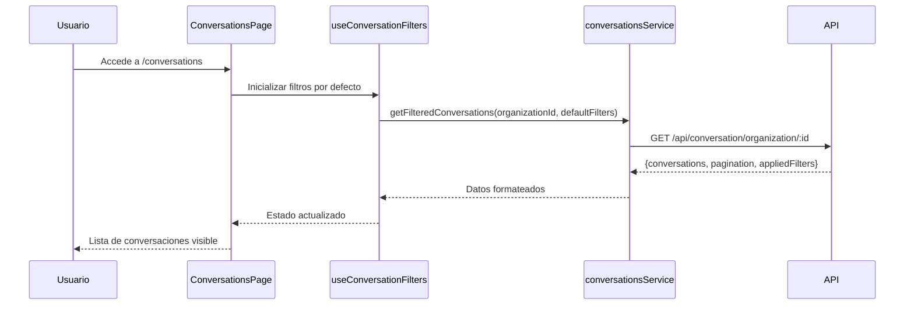
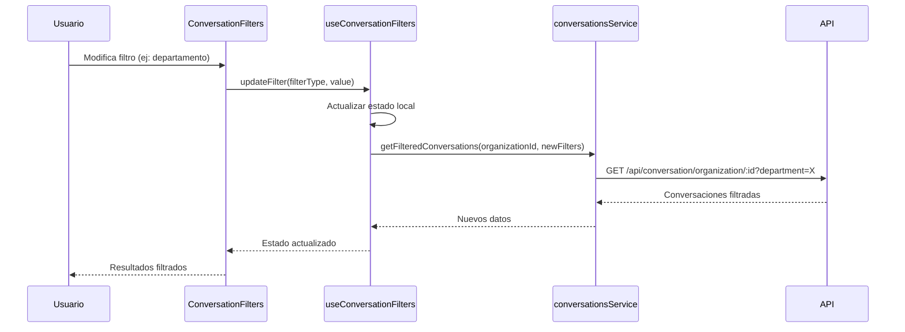
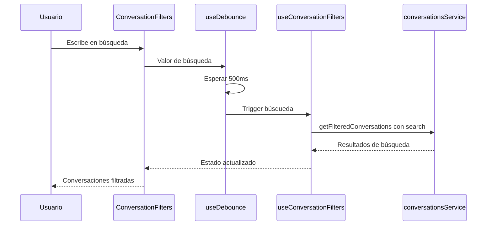

# Caso de Uso: Sistema de Conversaciones con Filtros Avanzados

## Descripción General

Este caso de uso describe la implementación del sistema mejorado de listado de conversaciones que incluye filtros avanzados, paginación del servidor, ordenamiento y visualización optimizada de información de usuarios.

## Actores

- **Usuario Administrador**: Gestiona conversaciones de la organización
- **Usuario HITL**: Revisa y asigna conversaciones que requieren intervención humana
- **Usuario Supervisor**: Monitorea el estado general de las conversaciones

## Objetivos

### Objetivo Principal
Proporcionar una interfaz eficiente para navegar, filtrar y gestionar grandes volúmenes de conversaciones con información detallada de usuarios.

### Objetivos Específicos
- Implementar paginación del servidor para mejorar performance
- Ofrecer filtros avanzados para búsqueda específica
- Mostrar información de usuario de forma progresiva
- Mantener la funcionalidad existente de asignación HITL

## Precondiciones

- Usuario autenticado en el sistema
- Usuario tiene permisos para ver conversaciones de la organización
- Endpoint `/api/conversation/organization/:organizationId` está actualizado
- OrganizationId está disponible en el estado global

## Flujo Principal

### 1. Carga Inicial de Conversaciones



### 2. Aplicación de Filtros



### 3. Búsqueda con Debounce



## Flujos Alternativos

### A1. Sin Resultados Encontrados
1. Usuario aplica filtros que no tienen coincidencias
2. Sistema muestra estado vacío con mensaje "No hay conversaciones"
3. Usuario puede limpiar filtros para ver todas las conversaciones

### A2. Error en Carga de Datos
1. Falla la comunicación con el servidor
2. Sistema muestra mensaje de error
3. Usuario puede reintentar la carga

### A3. Visualización de Información de Usuario
1. Usuario ve conversación con icono de información (ⓘ)
2. Usuario hace hover sobre el icono
3. Tooltip muestra información adicional (email, teléfono)

## Postcondiciones

### Éxito
- Conversaciones mostradas según filtros aplicados
- Paginación funcionando correctamente
- Filtros persistentes durante la sesión
- Información de usuario disponible cuando existe

### Fallo
- Sistema muestra mensaje de error apropiado
- Filtros se mantienen para reintento
- Usuario puede navegar a otras secciones

## Componentes Involucrados

### Componentes Principales
- `ConversationsPage`: Componente principal
- `ConversationFilters`: Panel de filtros
- `ConversationsList`: Lista de conversaciones
- `ConversationCard`: Card individual de conversación
- `TablePagination`: Componente de paginación

### Hooks Personalizados
- `useConversationFilters`: Manejo de estado de filtros
- `useServerPagination`: Paginación del servidor
- `useDebounce`: Optimización de búsqueda
- `useConversationSort`: Ordenamiento de columnas

### Servicios
- `conversationsService.getFilteredConversations`: Obtener conversaciones filtradas
- `conversationsService.buildQueryParams`: Construir parámetros de consulta

## Interfaces de Datos


### Respuesta de Conversaciones
```typescript
interface ConversationListResponse {
  ok: boolean;
  conversations: EnhancedConversationListItem[];
  pagination: {
    currentPage: number;
    totalPages: number;
    totalItems: number;
    itemsPerPage: number;
    hasNextPage: boolean;
    hasPreviousPage: boolean;
  };
  appliedFilters: ConversationFilters;
}
```

### Conversación Mejorada
```typescript
interface EnhancedConversationListItem extends ConversationListItem {
  user_name?: string;
  user_email?: string;
  user_phone?: string;
  integration_type: IntegrationType;
}
```

## Reglas de Negocio

### RN-01: Paginación
- Máximo 100 elementos por página
- Mínimo 1 elemento por página
- Default: 20 elementos por página

### RN-02: Búsqueda
- Mínimo 2 caracteres para activar búsqueda
- Búsqueda case-insensitive
- Debounce de 500ms para optimizar requests

### RN-03: Filtros
- Filtros se pueden combinar
- Filtros persisten durante la sesión
- Cambio de filtros resetea paginación a página 1

### RN-04: Información de Usuario
- Mostrar nombre si está disponible, sino "Usuario"
- Icono de información solo si hay datos adicionales
- Tooltip no debe bloquear la interfaz

### RN-05: Ordenamiento
- Solo una columna puede estar ordenada a la vez
- Ordenamiento por defecto: created_at DESC
- Mantener otros filtros al cambiar ordenamiento

## Validaciones

### Frontend
- Validar formato de fechas antes de enviar
- Validar que fecha inicio < fecha fin
- Validar límites de paginación

### Backend
- Validar permisos de organización
- Sanitizar parámetros de búsqueda
- Validar límites de paginación (max 100)

## Manejo de Errores

### Errores de Validación
- Mostrar mensaje específico al usuario
- Mantener estado de filtros válidos
- Permitir corrección sin pérdida de contexto

### Errores de Comunicación
- Mostrar botón de reintento
- Mantener filtros aplicados
- Log de errores para debugging

### Errores de Permisos
- Redirigir a página de acceso denegado
- Limpiar estado de conversaciones
- Mostrar mensaje apropiado

## Consideraciones de Performance

### Optimizaciones Frontend
- Debounce en búsqueda
- Memoización de componentes pesados
- Lazy loading de dropdowns

### Optimizaciones Backend
- Índices en campos de búsqueda
- Paginación eficiente
- Cache de filtros frecuentes

## Testing

### Casos de Prueba
1. **Carga inicial**: Verificar que se cargan conversaciones por defecto
2. **Filtros individuales**: Cada filtro funciona correctamente
3. **Filtros combinados**: Múltiples filtros se aplican correctamente
4. **Búsqueda**: Buscar por nombre, email y teléfono
5. **Paginación**: Navegación entre páginas mantiene filtros
6. **Ordenamiento**: Cambiar orden mantiene filtros
7. **Estados vacíos**: Manejar correctamente sin resultados
8. **Errores**: Manejar errores de comunicación

### Datos de Prueba
- Conversaciones con y sin información de usuario
- Conversaciones de diferentes departamentos
- Conversaciones de diferentes canales
- Conversaciones en diferentes estados HITL

## Migración

### Compatibilidad
- Mantener funcionalidad existente de asignación HITL
- Preservar rutas de navegación existentes
- Mantener sistema de exportación

### Datos
- No requiere migración de datos
- Nuevos campos son opcionales
- Fallback a comportamiento anterior si falta información

## Monitoreo

### Métricas
- Tiempo de respuesta de filtros
- Uso de diferentes tipos de filtros
- Errores de carga de conversaciones
- Performance de búsqueda

### Alertas
- Latencia alta en filtros (>2s)
- Tasa de error alta (>5%)
- Búsquedas sin resultados frecuentes

Este caso de uso proporciona la base técnica y funcional para implementar el sistema mejorado de conversaciones con filtros avanzados y paginación del servidor.
