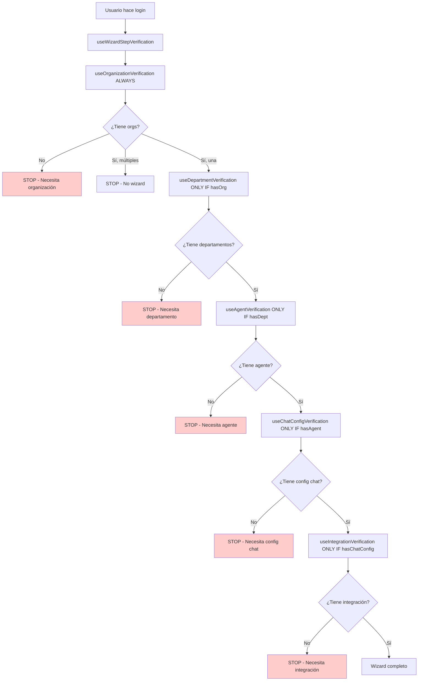

# Sistema de Wizard Dinámico

## Descripción General

El nuevo sistema de wizard reemplaza la gestión de pasos basada en localStorage por un sistema dinámico que verifica automáticamente el estado actual del usuario y determina qué pasos necesita completar.

## Arquitectura

### Hooks de Verificación

#### 1. `useOrganizationVerification`
```typescript
// Ubicación: /src/hooks/wizard/useOrganizationVerification.ts
```
- **Responsabilidad**: Verifica si el usuario tiene organizaciones
- **Reglas**:
  - Si tiene múltiples organizaciones: no muestra wizard
  - Si es super admin: no muestra wizard
  - Si no tiene organizaciones: necesita crear una

#### 2. `useDepartmentVerification`
```typescript
// Ubicación: /src/hooks/wizard/useDepartmentVerification.ts
```
- **Responsabilidad**: Verifica si la organización tiene departamentos
- **Servicio**: Usa `getDepartments(organizationId)`
- **Reglas**:
  - Si no tiene departamentos: necesita crear uno
  - Si tiene departamentos: paso completado

#### 3. `useAgentVerification`
```typescript
// Ubicación: /src/hooks/wizard/useAgentVerification.ts
```
- **Responsabilidad**: Verifica si el departamento tiene un agente
- **Servicio**: Usa `getWorkspaceData(departmentId)`
- **Reglas**:
  - Si no tiene agente: necesita configurar uno
  - Si tiene agente: paso completado

#### 4. `useChatConfigVerification`
```typescript
// Ubicación: /src/hooks/wizard/useChatConfigVerification.ts
```
- **Responsabilidad**: Verifica si existe configuración de chat
- **Servicio**: Usa `getIntegrationWebChat(departmentId, organizationId)`
- **Reglas**:
  - Si no tiene configuración de chat: necesita configurar
  - Si tiene title y subtitle/description: paso completado

#### 5. `useIntegrationVerification`
```typescript
// Ubicación: /src/hooks/wizard/useIntegrationVerification.ts
```
- **Responsabilidad**: Verifica si existe integración web chat
- **Servicio**: Usa `getIntegrationWebChat(departmentId, organizationId)`
- **Reglas**:
  - Si no tiene integración: necesita crear una
  - Si tiene integración: paso completado

### Hook Principal

#### `useWizardStepVerification`
```typescript
// Ubicación: /src/hooks/wizard/useWizardStepVerification.ts
```
- **Responsabilidad**: Coordina todas las verificaciones
- **Retorna**:
  - `shouldShowWizard`: Boolean que determina si mostrar el wizard
  - `currentStep`: Siguiente paso que necesita completar
  - `steps`: Array con el estado de todos los pasos
  - `organizationId`, `departmentId`, `agentId`, `integrationId`: IDs relevantes
  - `isLoading`, `hasErrors`: Estados de carga y error

## Flujo de Verificación



## Beneficios del Nuevo Sistema

### 1. **Eliminación del LocalStorage**
- Ya no se depende de estados guardados en localStorage
- La verificación es siempre dinámica y actualizada
- Evita inconsistencias entre localStorage y estado real

### 2. **Verificación Serial (NUEVO)**
- Solo se ejecuta la verificación del paso que corresponde
- No se hacen llamadas innecesarias a la API
- Cada hook solo se ejecuta cuando el anterior está completado
- Estados inicializados en `false` hasta verificación real

### 3. **Reutilización de Servicios**
- Usa exclusivamente servicios existentes
- No hace llamadas directas a endpoints
- Mantiene consistencia con el resto de la aplicación

### 4. **Flexibilidad**
- Fácil agregar/quitar pasos
- Cada hook es independiente y reutilizable
- Lógica de negocio centralizada en cada hook

### 5. **Mejor UX y Performance**
- El usuario ve exactamente el siguiente paso que necesita
- No hay verificaciones innecesarias en paralelo
- Carga más rápida al evitar múltiples llamadas API simultáneas
- No hay estados confusos de pasos futuros

## Migración desde el Sistema Anterior

### Componentes Actualizados

1. **`useInitialSetupRedirect`**: Ahora usa `useWizardStepVerification`
2. **`InitialSetupWizard`**: Eliminada dependencia de localStorage
3. **`WizardPage`**: Usa verificación dinámica para redirección

### Cambios en el Estado

- **Antes**: Estados en localStorage con `wizardState`
- **Ahora**: Verificación dinámica basada en datos del servidor
- **Compatibilidad**: Se limpia cualquier estado anterior en localStorage

## Reglas de Negocio

### Pasos Requeridos vs Opcionales

- **Requeridos**: organization, department, agent, chatConfig, integration
- **Opcionales**: knowledge, interface

### Condiciones para Saltar el Wizard

1. Usuario es super admin
2. Usuario tiene múltiples organizaciones
3. Todos los pasos requeridos están completados

### Manejo de Errores

- Cada hook maneja sus propios errores
- Errores 404 se consideran "no configurado" (no críticos)
- Otros errores se reportan como problemas de conectividad

## Uso

```typescript
// En cualquier componente
import { useWizardStepVerification } from '@hooks/wizard';

const MyComponent = () => {
  const wizard = useWizardStepVerification();
  
  // Ejemplo de estados seriales:
  console.log('Current step:', wizard.currentStep);
  // → Solo se ejecutará la verificación de este paso
  
  console.log('Steps status:', wizard.steps.map(s => ({
    step: s.step,
    completed: s.completed,
    required: s.required
  })));
  // → Los pasos futuros estarán en false hasta que sea su turno
  
  if (wizard.shouldShowWizard) {
    return <WizardComponent currentStep={wizard.currentStep} />;
  }
  
  return <DashboardComponent />;
};
```

## Extensibilidad

Para agregar un nuevo paso:

1. Crear hook de verificación: `useNewStepVerification.ts`
2. Agregar al enum `WizardStep` en `useWizardStepVerification.ts`
3. Incluir en el array de `steps` del hook principal
4. **IMPORTANTE**: Configurar cuándo debe ejecutarse serialmente:
   ```typescript
   const newStepVerification = useNewStepVerification(
     previousStepCompleted ? requiredData : undefined
   );
   ```
5. Actualizar mapeo en componentes que usen los pasos

### Reglas para Nuevos Pasos:
- **Inicializar en `false`**: Todos los estados deben empezar en falso
- **Condicionar ejecución**: Solo ejecutar cuando el paso anterior esté completo
- **Resetear cuando no aplica**: Limpiar estados si no debe ejecutarse
- **Una verificación a la vez**: No hacer verificaciones paralelas innecesarias