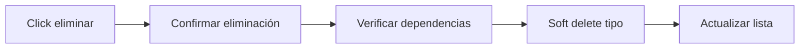
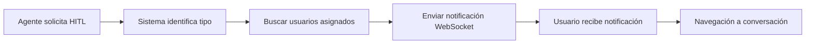

# Sistema HITL (Human In The Loop) - Caso de Uso

## Descripción General
Sistema que permite a los OWNER de organizaciones gestionar tipos especializados de intervención humana y asignar múltiples usuarios a cada tipo. Un usuario puede estar asignado a varios tipos HITL diferentes. Los usuarios HITL reciben notificaciones cuando se requiere su intervención.

## Actores
- **OWNER**: Gestiona tipos HITL y asigna usuarios
- **HITL**: Recibe notificaciones y puede intervenir
- **Sistema**: Envía notificaciones automáticas

## Flujo Principal

```mermaid
graph TD
    A[OWNER accede a gestión HITL] --> B[Lista tipos HITL existentes]
    B --> C{¿Crear nuevo tipo?}
    C -->|Sí| D[Formulario nuevo tipo HITL]
    C -->|No| E[Gestionar tipo existente]
    
    D --> F[Validar datos del tipo]
    F --> G[Crear tipo HITL]
    G --> H[Asignar usuarios HITL]
    
    E --> I{¿Editar o asignar usuarios?}
    I -->|Editar| J[Formulario edición]
    I -->|Usuarios| H
    
    H --> K[Seleccionar usuarios con rol HITL]
    K --> L[Confirmar asignaciones]
    L --> M[Sistema listo para notificaciones]
    
    M --> N[Notificación recibida con formato [tipo]]
    N --> O{¿Usuario es HITL?}
    O -->|No| P[Notificación normal]
    O -->|Sí| Q[Verificar tipo HITL existe]
    Q -->|No existe| P
    Q -->|Existe| R[Toast clickeable para auto-asignación]
    R --> S{¿Usuario hace click?}
    S -->|No| T[Toast se auto-cierra]
    S -->|Sí| U[Asignar conversación automáticamente]
    U --> V{¿Asignación exitosa?}
    V -->|Sí| W[Mensaje éxito - SIN navegación]
    V -->|Ya asignado| X[Mensaje informativo]
    V -->|Error| Y[Mensaje de error]
```

## Componentes Involucrados

### Páginas
- `HitlPage` - `/src/pages/Hitl/index.tsx` - Página principal del sistema HITL

### Componentes
- `HitlTypesList` - `/src/components/Hitl/HitlTypesList.tsx` - Lista de tipos HITL
- `HitlTypeForm` - `/src/components/Hitl/HitlTypeForm.tsx` - Formulario crear/editar tipo HITL
- `HitlUsersManagement` - `/src/components/Hitl/HitlUsersManagement.tsx` - Gestión usuarios asignados
- `HitlNotificationBadge` - `/src/components/Hitl/HitlNotificationBadge.tsx` - Notificaciones en tiempo real

### Hooks (Casos de Uso)
- `useHitlTypes` - `/src/hooks/useHitlTypes.ts` - Gestión CRUD tipos HITL
- `useHitlUserAssignments` - `/src/hooks/useHitlUserAssignments.ts` - Asignación usuarios
- `useHitlNotifications` - `/src/hooks/useHitlNotifications.ts` - Notificaciones tiempo real

- `useHitlPermissions` - `/src/hooks/useHitlPermissions.ts` - Verificación permisos

### Servicios
- `hitlService` - `/src/services/hitl.service.ts` - API calls completas para sistema HITL

### Interfaces
- `hitl.interface.ts` - `/src/interfaces/hitl.interface.ts` - Todas las interfaces del sistema

## Estructura de Datos

### HitlType
```typescript
interface HitlType {
  id: number;
  name: string;
  description: string;
  organization_id: number;
  created_by: number;
  created_at: string;
  updated_at: string;
  deleted_at: string | null;
  creator: UserBasic;
  userHitlTypes: HitlUserAssignment[];
}
```

### HitlUserAssignment
```typescript
interface HitlUserAssignment {
  id: number;
  user_id: number;
  hitl_type_id: number;
  organization_id: number;
  created_at: string;
  user: UserBasic;
}
```

### HitlNotification
```typescript
interface HitlNotification {
  type: string;
  message: string;
  conversationId: number;
  hitlType: string;
  timestamp: string;
}
```

## Reglas de Negocio

### Permisos
- Solo OWNER puede crear/editar/eliminar tipos HITL
- Solo OWNER puede asignar/remover usuarios HITL
- Solo usuarios con rol HITL pueden ser asignados
- Usuarios HITL solo ven notificaciones de sus tipos asignados

### Validaciones
- Nombre tipo HITL único por organización
- Nombre: 3-50 caracteres, alfanumérico y guiones bajos
- Descripción: 10-255 caracteres
- Al menos un usuario debe estar asignado para activar notificaciones

### Capacidades de Asignación
- **Múltiples usuarios pueden asignarse al mismo tipo HITL** para mayor cobertura
- **Un usuario puede estar asignado a múltiples tipos HITL diferentes** para flexibilidad
- **Asignación y remoción en tiempo real** con actualización automática de estados

### Estados
- **Activo**: Tipo con usuarios asignados
- **Inactivo**: Tipo sin usuarios asignados
- **Eliminado**: Soft delete, no visible en UI

## Consideraciones Técnicas

### Enums
```typescript
enum HitlPermission {
  MANAGE_TYPES = 'MANAGE_TYPES',
  RECEIVE_NOTIFICATIONS = 'RECEIVE_NOTIFICATIONS'
}

enum HitlStatus {
  ACTIVE = 'ACTIVE',
  INACTIVE = 'INACTIVE',
  DELETED = 'DELETED'
}
```

### WebSocket Events
- `hitl-notification` - Nueva notificación para usuario HITL
- `hitl-assignment-updated` - Cambios en asignaciones

### Rutas
- `/organizations/:organizationId/hitl-types` - Sistema HITL completo (lista, crear, editar, gestionar usuarios)

### Navegación
- Enlace dinámico en sidebar: "Sistema HITL" con icono headset
- Visible para roles: OWNER, HITL
- Breadcrumb navegación para sub-vistas

## Dependencias
- `useSelector` - Estado Redux (auth, organizaciones)
- `useSweetAlert` - Confirmaciones y modales de operación
- `useSocket` - WebSocket para notificaciones tiempo real
- `React Router` - Navegación y parámetros de URL
- `React Hook Form` - Gestión formularios (implícito en validaciones)
- `Tailwind CSS` - Estilos y responsive design

## Funcionalidades Implementadas

### ✅ Gestión de Tipos HITL
- Crear, editar, eliminar tipos HITL
- Validaciones frontend y backend
- Estados: Activo/Inactivo según usuarios asignados
- Confirmaciones para acciones destructivas

### ✅ Auto-Asignación por Notificaciones
- Detección automática de notificaciones con formato `[tipo_hitl]` en Navbar
- Verificación de existencia del tipo HITL en la organización
- Solo para usuarios con rol HITL
- Toast clickeable para asignación opcional de conversaciones
- Manejo de casos donde la conversación ya está asignada
- **Preserva el flujo del usuario** - Sin navegación automática

#### Reglas de Negocio - Auto-Asignación
- **Formato de detección**: Notificaciones que inician con `[nombre_tipo_hitl]`
- **Validación de tipo**: El tipo debe existir en la organización actual
- **Permisos**: Solo usuarios con rol HITL ven el toast de auto-asignación
- **Comportamiento**: Toast clickeable que permite asignación opcional
- **Sin navegación automática**: Preserva el flujo actual del usuario
- **Estados de respuesta**:
  - Éxito: Mensaje de confirmación
  - Ya asignado: Mensaje informativo
  - Error: Mensaje de error

### ✅ Gestión de Usuarios
- Asignar/remover múltiples usuarios con rol HITL
- Interfaz simplificada con información relevante para el administrador
- Estadísticas en tiempo real: usuarios asignados vs disponibles
- Selector de usuarios disponibles con selección múltiple
- Verificación automática de permisos
- Confirmaciones para acciones de remoción

### ✅ Sistema de Permisos
- Verificación dinámica de permisos por organización
- Control de acceso basado en roles
- Redirección automática sin permisos

### ✅ Notificaciones Tiempo Real
- Integración con WebSocket existente
- Indicador visual de notificaciones nuevas
- Toast notifications con navegación directa
- Estado de conexión en tiempo real

### ✅ Experiencia de Usuario
- Interfaz simplificada enfocada en acciones prácticas
- Estadísticas relevantes: usuarios asignados y disponibles para asignar
- Indicadores visuales de estado del tipo HITL (activo/inactivo)
- Loading states y skeleton screens
- Estados vacíos con CTAs claros
- Responsive design (móvil/desktop)
- Feedback visual para todas las operaciones
- Recordatorios informativos sobre capacidades de asignación múltiple

## Flujos Secundarios

### Eliminación de Tipo HITL


### Notificación HITL

