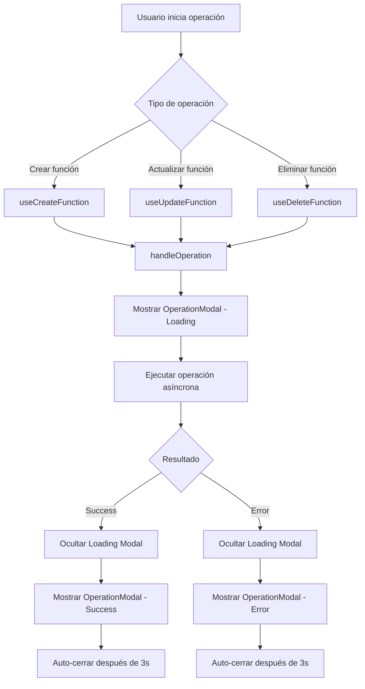

# Modal de Loading - Caso de Uso

## Descripción
Sistema de modales para mostrar estados de carga, éxito y error durante operaciones asíncronas en el formulario de edición de funciones y otros componentes del sistema.

## Flujo Principal



## Componentes Involucrados

### OperationModal
- **Ubicación**: `src/components/OperationModal.tsx`
- **Responsabilidad**: Renderizar modal con diferentes estados (loading, success, error)
- **Estados**:
  - loading: Spinner animado
  - success: Ícono de éxito
  - error: Ícono de error

### AlertContext
- **Ubicación**: `src/components/Diagrams/components/AlertContext.tsx`
- **Responsabilidad**: Proveer contexto global para modales de alerta
- **Funciones**: `handleOperation`, `showConfirmation`, `hideOperationModal`

### useSweetAlert Hook
- **Ubicación**: `src/hooks/useSweetAlert.ts`
- **Responsabilidad**: Lógica central para manejo de modales
- **Funciones principales**:
  - `handleOperation`: Ejecuta operaciones con feedback visual
  - `showOperationModal`: Controla visualización de modales

### useFunctionActions Hook
- **Ubicación**: `src/components/Diagrams/hooks/useFunctionActions.ts`
- **Responsabilidad**: Operaciones CRUD específicas para funciones
- **Hooks exportados**:
  - `useCreateFunction`
  - `useUpdateFunction`
  - `useDeleteFunction`
  - `useFunctionSuccess`

### useAuthenticatorActions Hook
- **Ubicación**: `src/components/Diagrams/hooks/useAuthenticatorActions.ts`
- **Responsabilidad**: Operaciones CRUD específicas para autenticadores
- **Hooks exportados**:
  - `useCreateAuthenticator`
  - `useUpdateAuthenticator`
  - `useDeleteAuthenticator`
  - `useFetchAuthenticators`
  - `useAssignAuthenticator`
  - `useAuthenticatorSuccess`

## Estructura de Datos

### OperationModalOptions
```typescript
{
  title: string;
  text: string;
  type: "loading" | "success" | "error";
  autoCloseDelay?: number;
}
```

### HandleOperationOptions
```typescript
{
  title: string;
  successTitle: string;
  successText: string;
  errorTitle: string;
  loadingTitle?: string;
  showSuccess?: boolean; // Por defecto true
}
```

## Casos de Uso Específicos

### 1. Crear Función
- **Trigger**: Submit en FunctionForm sin functionId
- **Loading Title**: "Creando función"
- **Success**: "Función creada exitosamente"
- **Error**: Formateo automático del error de API

### 2. Actualizar Función
- **Trigger**: Submit en FunctionForm con functionId
- **Loading Title**: "Actualizando función"
- **Success**: "Función actualizada exitosamente"
- **Error**: Formateo automático del error de API

### 3. Eliminar Función
- **Trigger**: Acción de eliminación con confirmación previa
- **Loading Title**: "Eliminando función"
- **Success**: "Función eliminada exitosamente"
- **Error**: Formateo automático del error de API

### 4. Configuración WhatsApp Manual
- **Trigger**: Apertura del modal de configuración
- **Loading Title**: "Cargando configuración de WhatsApp"
- **Success**: Deshabilitado (showSuccess: false)
- **Error**: Formateo automático del error de API

### 5. Guardar Configuración WhatsApp
- **Trigger**: Submit del formulario de configuración
- **Loading Title**: "Guardando configuración de WhatsApp"
- **Success**: "Se ha guardado la información de WhatsApp"
- **Error**: Formateo automático del error de API

### 6. Actualizar Webhook WhatsApp
- **Trigger**: Click en botón de refresh webhook
- **Loading Title**: "Actualizando código webhook"
- **Success**: "Se ha generado un nuevo código webhook"
- **Error**: Formateo automático del error de API

### 7. Configuración Messenger Manual
- **Trigger**: Apertura del modal de configuración
- **Loading Title**: "Cargando configuración de Messenger"
- **Success**: Deshabilitado (showSuccess: false)
- **Error**: Formateo automático del error de API

### 8. Guardar Configuración Messenger
- **Trigger**: Submit del formulario de configuración
- **Loading Title**: "Guardando configuración de Messenger"
- **Success**: "Se ha guardado la información de Messenger"
- **Error**: Formateo automático del error de API

### 9. Actualizar Webhook Messenger
- **Trigger**: Click en botón de refresh webhook
- **Loading Title**: "Actualizando código webhook"
- **Success**: "Se ha generado un nuevo código webhook"
- **Error**: Formateo automático del error de API

### 10. Configuración Slack
- **Trigger**: Apertura del modal de configuración
- **Loading Title**: "Cargando configuración de Slack"
- **Success**: Deshabilitado (showSuccess: false)
- **Error**: Formateo automático del error de API

### 11. Cambiar Canal Slack
- **Trigger**: Submit del formulario de canal
- **Loading Title**: "Guardando configuración de Slack"
- **Success**: "Se ha actualizado el nombre del canal de Slack"
- **Error**: Formateo automático del error de API

### 12. Configuración Chat Web
- **Trigger**: Apertura del modal de personalización
- **Loading Title**: "Cargando configuración del chat"
- **Success**: Deshabilitado (showSuccess: false)
- **Error**: Formateo automático del error de API

### 13. Guardar Configuración Chat Web
- **Trigger**: Submit del formulario de configuración
- **Loading Title**: "Guardando configuración del chat"
- **Success**: "La configuración del chat se ha guardado exitosamente"
- **Error**: Formateo automático del error de API

### 14. Guardar Logo Chat Web
- **Trigger**: Upload y crop de logo
- **Loading Title**: "Guardando logo del chat"
- **Success**: "El logo se ha guardado exitosamente"
- **Error**: Formateo automático del error de API

### 15. Eliminar Logo Chat Web
- **Trigger**: Click en botón de eliminar logo
- **Loading Title**: "Eliminando logo del chat"
- **Success**: "El logo se ha eliminado exitosamente"
- **Error**: Formateo automático del error de API

### 16. Crear Autenticador
- **Trigger**: Submit del formulario de crear autenticador
- **Loading Title**: "Creando autenticador"
- **Success**: "Autenticador creado exitosamente"
- **Error**: Formateo automático del error de API

### 17. Actualizar Autenticador
- **Trigger**: Submit del formulario de editar autenticador
- **Loading Title**: "Actualizando autenticador"
- **Success**: "Autenticador actualizado exitosamente"
- **Error**: Formateo automático del error de API

### 18. Eliminar Autenticador
- **Trigger**: Click en botón de eliminar autenticador con confirmación previa
- **Loading Title**: "Eliminando autenticador"
- **Success**: "Autenticador eliminado exitosamente"
- **Error**: Formateo automático del error de API

### 19. Cargar Lista de Autenticadores
- **Trigger**: Apertura del modal de gestión de autenticadores
- **Loading Title**: "Cargando autenticadores"
- **Success**: Deshabilitado (showSuccess: false)
- **Error**: Formateo automático del error de API

### 20. Asignar Autenticador a Función
- **Trigger**: Click en autenticador para asignarlo a función
- **Loading Title**: "Asignando autenticador a función"
- **Success**: "Autenticador asignado exitosamente"
- **Error**: Formateo automático del error de API

### 21. Remover Autenticador de Función
- **Trigger**: Click en autenticador ya asignado para removerlo
- **Loading Title**: "Removiendo autenticador de función"
- **Success**: "Autenticador removido exitosamente"
- **Error**: Formateo automático del error de API

## Reglas de Negocio

1. **Auto-cierre**: Modales de success/error se cierran automáticamente después de 3 segundos
2. **Modal de loading**: No se puede cerrar manualmente
3. **Formateo de errores**: Manejo automático de errores de Axios y API
4. **Estado único**: Solo un modal de operación puede estar activo a la vez
5. **Z-index**: Modal tiene z-index 1100 para estar sobre otros modales (RawModal: 1000)
6. **Control de success**: Opción `showSuccess` permite deshabilitar modal de éxito (útil para cargas iniciales)
## Dependencias

- **React Portal**: Para renderizado fuera del DOM normal
- **Lottie**: Para animaciones de loading (componente Loading separado)
- **Tailwind CSS**: Para estilos y animaciones CSS

## Consideraciones Técnicas

- **Prevención de múltiples ejecuciones**: Verificación de `externalLoading` antes de ejecutar
- **Cleanup**: Destrucción automática de animaciones Lottie
- **Error handling**: Captura y formateo de diferentes tipos de errores
- **Performance**: Uso de portales para evitar re-renders innecesarios
- **Z-index hierarchy**: OperationModal (1100) > RawModal (1000) > Modal base (999)
- **Conditional success**: Usar `showSuccess: false` para operaciones de carga inicial
