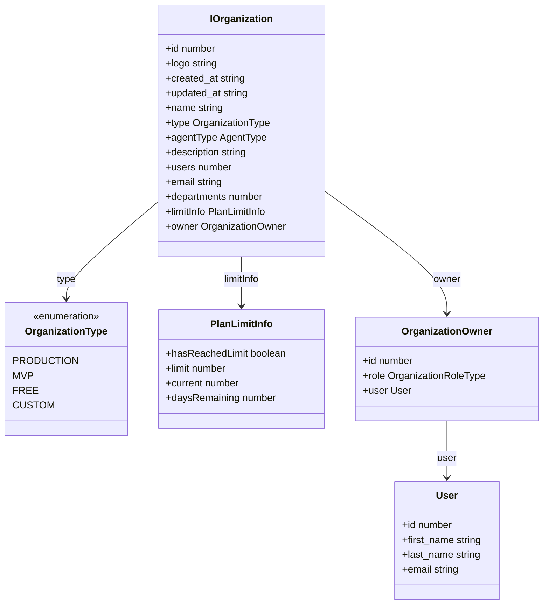
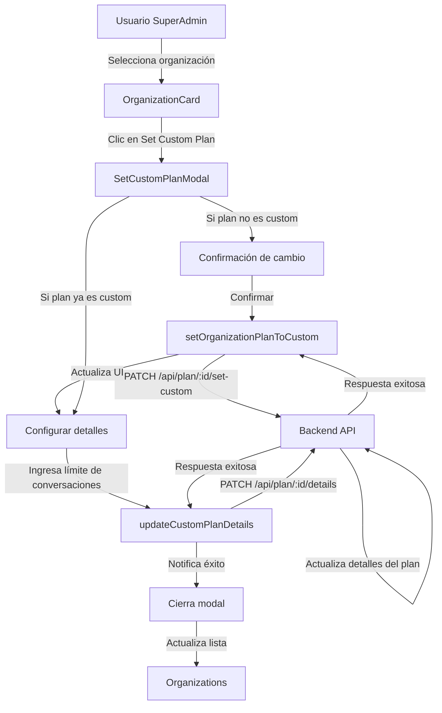
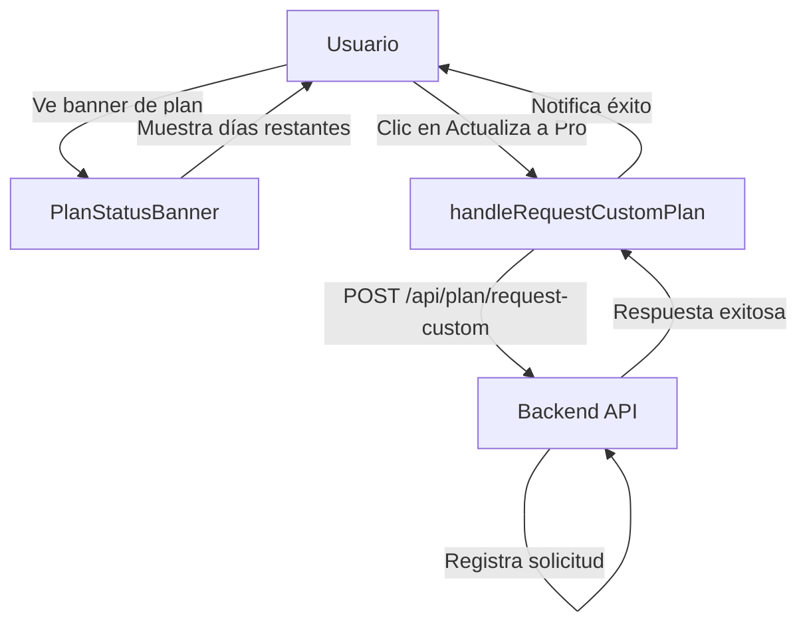
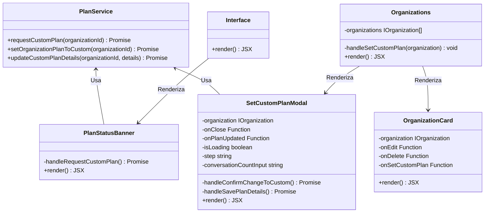
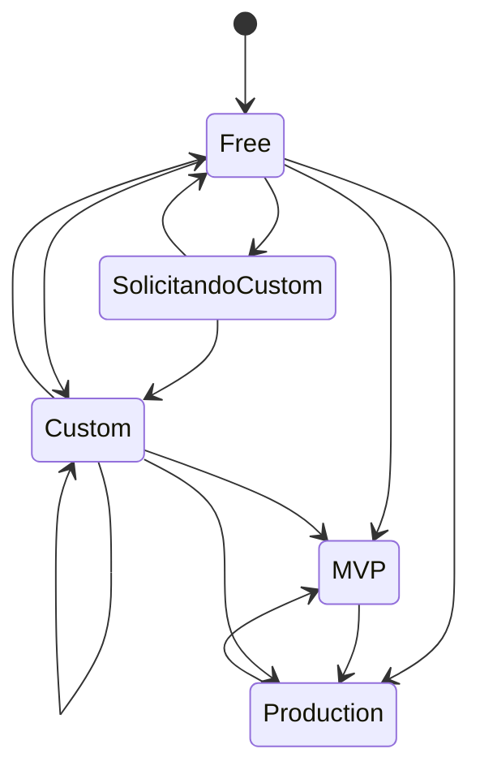

# Diagramas de Gestión de Planes de Organización

Este documento describe la arquitectura y flujos relacionados con la gestión de planes de organización en Sofia Chat Frontend.

## Estructura de Datos de Planes

## Flujo de Gestión de Planes Personalizados

## Flujo de Solicitud de Plan Personalizado

## Arquitectura de Componentes de Planes

## Ciclo de Vida del Plan de Organización

