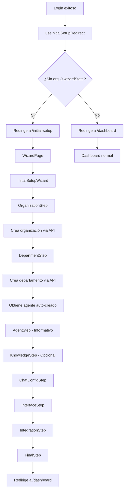

# Initial Setup Wizard Use Case

## Qué hace
Guía al usuario sin organización o con wizard incompleto a través de un proceso paso a paso para crear su organización, departamento y configurar su asistente virtual. El wizard ahora se activa automáticamente después del login si se cumplen las condiciones.

## Flujo



## Componentes y Responsabilidades

### useInitialSetupRedirect Hook
- Determina si debe mostrar wizard o dashboard
- Verifica estado de organizaciones y localStorage
- Ubicación: `/src/hooks/useInitialSetupRedirect.ts`

### usePostLoginRedirect Hook
- Maneja redirección después del login
- Usa useInitialSetupRedirect para decidir destino
- Ubicación: `/src/hooks/usePostLoginRedirect.ts`

### WizardPage
- Página dedicada para el wizard (/initial-setup)
- Maneja redirección si usuario no debería estar ahí
- Ubicación: `/src/pages/InitialSetup/WizardPage.tsx`

### InitialSetupWizard
- Componente principal del wizard
- Maneja navegación entre pasos con estados visuales
- Coordina el flujo completo
- Ubicación: `/src/components/InitialSetupWizard/index.tsx`

### useSetupWizard Hook
- Procesa cada paso del wizard
- Llama a servicios API correspondientes
- Mantiene IDs creados (organization, department, agent)
- Ubicación: `/src/components/InitialSetupWizard/hooks/useSetupWizard.ts`

### useTabNavigation Hook
- Maneja navegación entre tabs
- Define estructura de tabs
- Controla estado del tab activo
- Ubicación: `/src/components/InitialSetupWizard/hooks/useTabNavigation.tsx`

### ConfigPanel con Layouts
- Contenedor flexible para diferentes tipos de tabs
- Layout "wizard": Lista numerada vertical con estados
- Layout "default": Tabs horizontales tradicionales
- Ubicación: `/src/components/ConfigPanel/`

### Pasos del Wizard

#### OrganizationStep
- Formulario para crear organización
- Upload de logo
- Ubicación: `/src/components/InitialSetupWizard/steps/OrganizationStep.tsx`

#### DepartmentStep
- Formulario para crear departamento
- Sugerencias de departamentos comunes
- Ubicación: `/src/components/InitialSetupWizard/steps/DepartmentStep.tsx`

#### AgentStep
- Vista informativa (agente se crea automáticamente)
- Muestra características del agente
- Ubicación: `/src/components/InitialSetupWizard/steps/AgentStep.tsx`

#### KnowledgeStep
- Upload de archivos para base de conocimiento
- Drag & drop interface
- Paso opcional
- Ubicación: `/src/components/InitialSetupWizard/steps/KnowledgeStep.tsx`

#### ChatConfigStep
- Configuración de textos del chat
- Preview en tiempo real
- Ubicación: `/src/components/InitialSetupWizard/steps/ChatConfigStep.tsx`

#### InterfaceStep
- Personalización de colores
- Posición del widget
- Temas predefinidos
- Ubicación: `/src/components/InitialSetupWizard/steps/InterfaceStep.tsx`

#### IntegrationStep
- Configuración de dominios permitidos
- Generación de código de integración
- Métodos: script, iframe, WordPress
- Ubicación: `/src/components/InitialSetupWizard/steps/IntegrationStep.tsx`

#### FinalStep
- Resumen de configuración
- Próximos pasos sugeridos
- Ubicación: `/src/components/InitialSetupWizard/steps/FinalStep.tsx`

## Estructura de Datos

### SetupFormData
```
{
  organization: {
    name: string
    description: string
    logo: File | null
  }
  department: {
    name: string
    description: string
  }
  agent: {
    id?: number  // Se obtiene automáticamente
  }
  knowledge: {
    files: File[]
    urls: string[]
  }
  chatConfig: {
    title: string
    subtitle: string
    description: string
    welcomeMessage: string
    placeholder: string
  }
  interface: {
    primaryColor: string
    backgroundColor: string
    textColor: string
    buttonStyle: 'rounded' | 'square'
    position: 'bottom-right' | 'bottom-left' | 'top-right' | 'top-left'
  }
  integration: {
    domains: string[]
  }
}
```

## Servicios Utilizados

- `createOrganization()` - `/api/organization`
- `createDepartment()` - `/api/departments`
- `getWorkspaceData()` - `/api/departments/{id}/workspace`
- `createKnowledgeBase()` - `/api/agent-knowledgebase/agent/{id}`
- `updateIntegrationWebChat()` - `/api/integration/web-chat/{id}`

## Reglas de Negocio

- Usuario sin organización O con wizardState en localStorage activa wizard automáticamente
- Redirección se maneja después del login exitoso, no en cada navegación
- Agente se crea automáticamente al crear departamento
- Base de conocimiento es paso opcional
- Wizard usa ConfigPanel con layout "wizard" para estructura de tabs
- Estados visuales de tabs: completado (verde + check), actual (azul), pendiente (gris)
- Si usuario cancela sin completar, redirige a login
- Al completar, actualiza organizaciones y redirige a dashboard
- Super admins nunca ven el wizard

## Estados de Tabs

- **Completado**: Fondo verde claro, texto verde, icono de check
- **Actual**: Fondo azul oscuro, texto blanco
- **Pendiente**: Texto gris, deshabilitado, no clickeable

## Flujo de Autenticación

1. Usuario hace login (email/password o Google)
2. Se ejecuta `usePostLoginRedirect`
3. Se evalúa si debe ir al wizard o dashboard
4. Se redirige automáticamente a la ruta correspondiente
5. Si va al wizard, se muestra en página dedicada `/initial-setup`