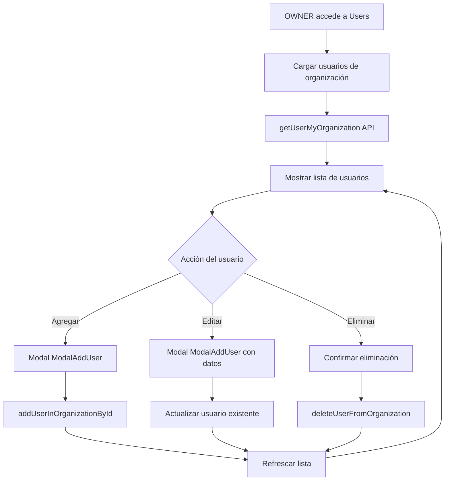

# Caso de Uso: Gestión de Usuarios en Organizaciones

## Descripción

Sistema para administrar usuarios dentro de una organización específica, incluyendo operaciones de listado, creación, edición y eliminación de usuarios con roles específicos.

## Flujo Principal



## Componentes Involucrados

### UsersOrganization (`/pages/Users/UsersOrganization/`)
- **Responsabilidad**: Contenedor principal con lógica de negocio
- **Estado local**: usuarios, modales, loading, usuario seleccionado
- **Permisos**: Solo OWNER puede agregar/eliminar usuarios
- **Hooks**: useState, useEffect, useSelector

### UserCard (`/pages/Users/UsersOrganization/UserCard.tsx`)
- **Responsabilidad**: Mostrar información de usuario individual
- **Props**: userData, onEdit, onDelete
- **UI**: Avatar, email, nombre, rol, botones de acción

### ModalAddUser (`/pages/Users/UsersOrganization/ModalAddUser.tsx`)
- **Responsabilidad**: Formulario para agregar/editar usuarios
- **Modos**: Creación y edición según prop editUser
- **Validación**: Email requerido, formato válido

## Servicios de Datos

### getUserMyOrganization
- **Endpoint**: `/api/user/all/${organizationId}`
- **Método**: GET
- **Retorna**: Array de usuarios con roles en la organización
- **Mapeo**: Transforma respuesta a formato IUserApi

### addUserInOrganizationById
- **Endpoint**: `/api/user/add/${organizationId}`
- **Método**: POST
- **Parámetros**: { email: string }
- **Función**: Invita usuario a organización

### deleteUserFromOrganization
- **Endpoint**: `/api/user/organization/${organizationId}/user/${userId}`
- **Método**: DELETE
- **Parámetros**: organizationId, userId
- **Función**: Elimina relación usuario-organización
- **Respuesta**: { userDeleted, roleDeleted, message }

## Estructura de Datos

### IUserApi Interface
```typescript
{
  id: number; // User ID usado para delete
  email: string;
  first_name: string | null;
  last_name: string | null;
  email_verified: boolean;
  last_login: string | null;
  userOrganizations: {
    role: OrganizationRoleType;
    organization: { id?: number; name?: string; } | null;
  }[];
}
```

### OrganizationRoleType Enum
- **OWNER**: Propietario con todos los permisos
- **ADMIN**: Administrador con permisos avanzados
- **SUPERVISOR**: Supervisor de conversaciones
- **HITL**: Agente humano en el bucle
- **USER**: Usuario básico solo lectura

## Reglas de Negocio

### Permisos por Rol
- **OWNER**: Puede agregar, editar y eliminar usuarios
- **ADMIN+**: Solo visualización (implementación futura)
- **Otros roles**: Sin acceso a gestión de usuarios

### Validaciones
- Email único por organización
- No se puede eliminar el último OWNER
- Usuario debe tener email válido
- Confirmación requerida para eliminación

### Estados de Usuario
- **Activo**: Usuario con acceso completo
- **Invitado**: Usuario invitado pendiente de activación
- **Eliminado**: Usuario removido de organización

## Casos de Error

### Permisos Insuficientes
- **Código**: 403 Forbidden
- **Mensaje**: "No tienes permisos para realizar esta acción"
- **Acción**: Toast de error, bloqueo de UI

### Usuario No Encontrado
- **Código**: 404 Not Found
- **Mensaje**: "El usuario especificado no existe"
- **Acción**: Refrescar lista, mostrar error

### Último Owner
- **Código**: 409 Conflict
- **Mensaje**: "No se puede eliminar el último propietario"
- **Acción**: Bloquear eliminación, mensaje explicativo

## Consideraciones Técnicas

### Performance
- Lista paginada para organizaciones grandes
- Cache local de usuarios durante sesión
- Optimistic updates en eliminación

### UX/UI
- Loading states en operaciones
- Confirmación modal para delete
- Toast notifications para feedback
- Diseño responsive grid layout

### Seguridad
- Verificación de permisos en frontend y backend
- Validación de userId y organizationId antes de eliminación
- Audit log de cambios de usuarios (backend)

## Dependencias

### Redux State
- `auth.selectOrganizationId`: Organización actual
- `auth.myOrganizations`: Roles del usuario autenticado
- `auth.user`: Datos del usuario actual

### Servicios Externos
- API de autenticación para validar permisos
- Sistema de notificaciones para invitaciones
- Logs de auditoría para tracking

### Librerías
- React Hook Form para formularios
- React Toastify para notificaciones
- Axios para llamadas HTTP