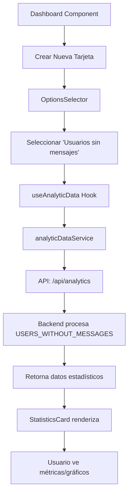

# Caso de Uso: Usuarios Sin Mensajes en Dashboard

## Propósito
Mostrar estadísticas de usuarios registrados que no han enviado mensajes en el dashboard de analytics.

## Flujo del Sistema



## Componentes y Responsabilidades

### Frontend Components
- **DashboardOrganization**: Renderiza grid de tarjetas analytics
- **StatisticsCard**: Contenedor principal de cada métrica
- **OptionsSelector**: Selector de tipos de datos analíticos
- **DataOptionsModal**: Modal con opciones disponibles

### Services
- **analyticDataService**: Obtiene datos del backend y aplica metadata
- **analyticTypes**: Define tipos y opciones disponibles

### Hooks
- **useDashboard**: Gestiona estado de tarjetas del dashboard
- **useAnalyticData**: Procesa datos para visualización

## Estructura de Archivos

```
src/
├── services/
│   ├── analyticTypes.ts          # Enum y opciones de USERS_WITHOUT_MESSAGES
│   └── analyticDataService.ts    # Metadata y procesamiento
├── components/
│   └── StatisticsCard/
│       ├── index.tsx             # Renderizado principal
│       └── OptionsSelector.tsx   # Selector de opciones
├── pages/
│   └── Home/
│       └── DashboardOrganization/
│           └── index.tsx         # Dashboard principal
└── hooks/
    ├── useDashboard.ts          # Estado de tarjetas
    └── useAnalyticData.ts       # Procesamiento de datos
```

## Estructura de Datos

### AnalyticType Enum
```
USERS_WITHOUT_MESSAGES = 'USERS_WITHOUT_MESSAGES'
```

### Metadata
```
{
  label: "Usuarios sin Mensajes",
  color: "#FF6B6B",
  description: "Usuarios sin mensajes por día"
}
```

### API Request
```
GET /api/analytics?organizationId=X&analyticTypes[]=USERS_WITHOUT_MESSAGES&startDate=Y&endDate=Z
```

### API Response
```
[{
  type: "USERS_WITHOUT_MESSAGES",
  value: number,
  created_at: Date,
  label: string,
  color: string
}]
```

## Reglas de Negocio

### Cálculo de Métricas
- **METRIC**: Suma total de usuarios sin mensajes
- **METRIC_AVG**: Promedio diario de usuarios sin mensajes
- **METRIC_ACUM**: Acumulado de usuarios sin mensajes
- **BAR/AREA**: Series temporales por día
- **PIE**: Proporción respecto a otros tipos de usuarios

### Cálculo de Tendencias
- **Tendencias individuales**: Cada métrica en la tarjeta tiene su propia tendencia
- **METRIC/METRIC_ACUM**: Comparación directa entre primer y último valor del período
- **METRIC_AVG**: Comparación entre promedio del primer día vs último día
- **Múltiples métricas**: Cada serie muestra su tendencia individual por separado
- **Casos especiales**: 
  - Valor inicial 0: Muestra crecimiento absoluto
  - Datos insuficientes (<2 puntos): No muestra tendencia para esa métrica
- **Formato**: Porcentaje con flecha direccional (↗/↘) bajo cada valor individual

### Rangos Temporales
- Últimos 7 días: Datos diarios
- Últimos 30 días: Datos diarios
- Últimos 6 meses: Agrupación por rangos
- Último año: Agrupación por rangos

### Visualización
- Color distintivo: #FF6B6B (rojo suave)
- Etiqueta: "Usuarios sin Mensajes"
- Soporte para todos los tipos de display
- Leyenda configurable

## Integración con Sistema Existente

### Compatibilidad
- Reutiliza infraestructura de analytics existente
- Compatible con sistema de tarjetas del dashboard
- Mantiene patrones de diseño establecidos

### Configuración
- Disponible en selector de opciones de datos
- Configurable por organización
- Persistencia en configuración de tarjetas

## Mejoras Implementadas

### Tendencias Mejoradas
- **Problema anterior**: Regresión lineal incorrecta, sin tendencias en tarjetas múltiples
- **Solución actual**: Tendencias individuales por métrica con comparación directa
- **Beneficios**:
  - **Tarjetas múltiples**: Cada métrica muestra su propia tendencia
  - **Cálculo correcto**: METRIC_AVG usa promedio diario real
  - **Precisión mejorada**: No mezcla diferentes tipos de analytics
  - **Casos edge**: Manejo robusto (división por cero, datos insuficientes)
  - **UX mejorada**: Tooltips explicativos y flechas direccionales
  - **Información completa**: Ya no se pierden tendencias en tarjetas con 4+ métricas

### Ejemplo de Uso
```
Tarjeta con 4 métricas:
├── TOTAL_USERS: 180 ↗ +80%
├── NEW_USERS: 20 ↘ 60%  
├── USERS_WITHOUT_MESSAGES: 12 ↗ +12
└── RECURRING_USERS: 25 ↗ +0%
```