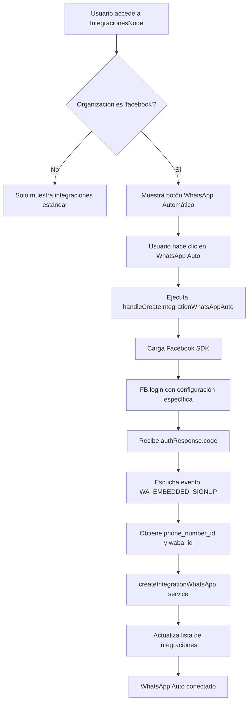

# Caso de Uso: Integración WhatsApp Automático

Integración automática de WhatsApp Business API a través de Facebook para organizaciones específicas.

## Flujo de Integración



## Componentes y Responsabilidades

### IntegracionesNode
- **Ubicación**: `src/components/Diagrams/IntegracionesNode.tsx`
- **Responsabilidad**: Nodo principal de integraciones
- **Funciones**:
  - Renderiza opciones de integración disponibles
  - Valida nombre de organización para WhatsApp automático
  - Gestiona creación de integraciones

### ButtonWhatsAppIntegration
- **Ubicación**: `src/components/Diagrams/NewIntegration/ButtonWhatsAppIntegration/index.tsx`
- **Responsabilidad**: Lógica de integración automática WhatsApp
- **Funciones**:
  - Maneja autenticación con Facebook
  - Procesa respuesta de Facebook SDK
  - Crea integración WhatsApp automática

## Estructura de Datos

### Configuración WhatsApp Automático
```typescript
interface WhatsAppAutoData {
  code: string | null;
  phone_number_id: string | null;
  waba_id: string | null;
}
```

### Contexto de Organización
```typescript
interface OrganizationContext {
  selectOrganizationId: number | null;
  myOrganizations: IOrganizarion[];
  organizationName: string;
}
```

## Reglas de Negocio

### Visibilidad Condicional
- Botón WhatsApp automático solo visible si `organization.name === "facebook"`
- Valida existencia de `selectedDepartmentId` y `selectOrganizationId`

### Flujo de Autenticación
1. Carga Facebook SDK usando `ensureFBSDKLoaded()`
2. Ejecuta `FB.login` con configuración específica
3. Recibe código de autorización
4. Escucha eventos de configuración desde Facebook
5. Combina datos para crear integración

### Integración con Backend
- Servicio: `createIntegrationWhatsApp`
- Parámetros: `departmentId`, `organizationId`, `whatsAppData`
- Actualiza contador para refrescar vista

## Elementos Visuales

### Ícono WhatsApp Automático
- Imagen base: `/mvp/whatsapp.svg`
- Indicador: Letra "A" pequeña superpuesta
- Tooltip: "WhatsApp Automático"

### Estados de Integración
- **Disponible**: Botón visible con ícono + "A"
- **En proceso**: Carga de Facebook SDK
- **Completado**: Integración creada exitosamente

## Servicios Externos

### Facebook SDK
- **Propósito**: Autenticación y configuración WhatsApp Business
- **Variables**: `VITE_FB_CONFIG_ID`
- **Eventos**: `WA_EMBEDDED_SIGNUP`

### createIntegrationWhatsApp
- **Ubicación**: `@services/facebook`
- **Función**: Crear integración WhatsApp automática
- **Parámetros**: departmentId, organizationId, data

## Dependencias

### Hooks y Contextos
- `useSelector`: Acceso a estado Redux
- `useCounter`: Actualización de integraciones
- `alertConfirm/alertError`: Notificaciones

### Servicios
- `ensureFBSDKLoaded`: Inicialización Facebook SDK
- `createIntegrationWhatsApp`: Creación de integración